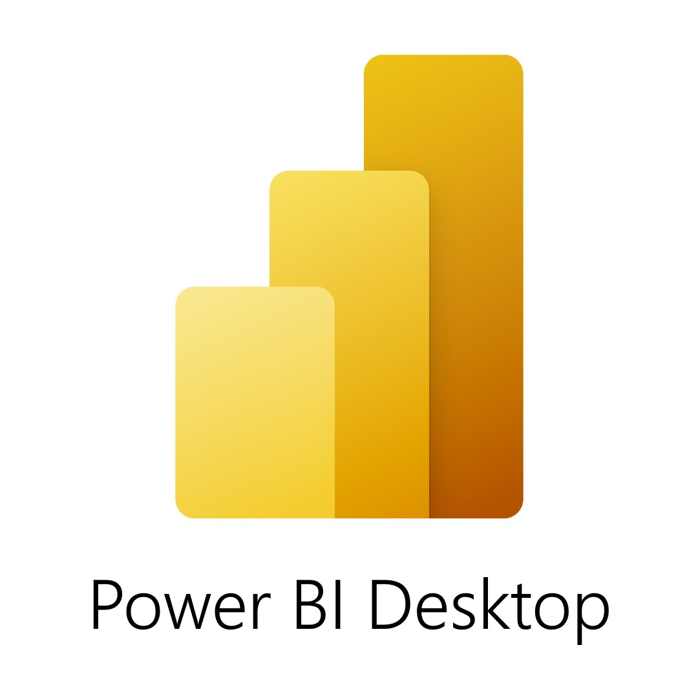

# Hello there! I'm Milena 👋🏼

 

## I'm an enthusiastic Data Analyst 👩🏻‍💻📊 

- 📚 I'm currently pursuing my Post-Graduate Certificate in Marketing Research and Analytics @Centennial College
- 📁 I'm developing my portfolio with all the data projects I have been working on
- 👯 I'm looking to collaborate on data science projects
- 📫 How to reach me: milenamartinezp9@gmail.com
- 😄 Pronouns: She/Her
- ⚡ Fun fact: I love puppies 🐶🐕. In my free time, I like to read📖, travel✈️ and cook👩🏻‍🍳 for my family and friends

### Languages and Tools:

 \

<!--
**milenamartinezp/milenamartinezp** is a ✨ _special_ ✨ repository because its `README.md` (this file) appears on your GitHub profile.

Here are some ideas to get you started:

- 🔭 I’m currently working on ...
- 🌱 I’m currently learning ...
- 👯 I’m looking to collaborate on ...
- 🤔 I’m looking for help with ...
- 💬 Ask me about ...
- 📫 How to reach me: ...
- 😄 Pronouns: ...
- ⚡ Fun fact: ...
-->
